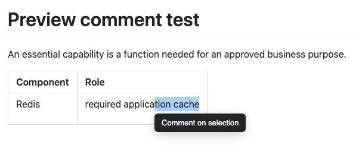
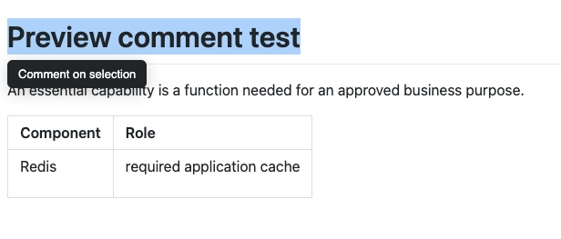
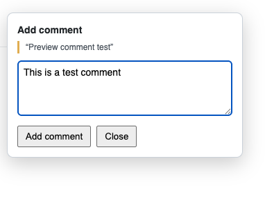
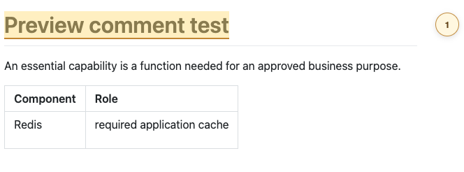
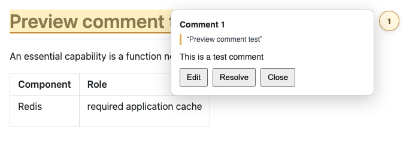

Markdown HTML Preview for Sublime Text 2/3
==========================================

Purpose
-------

I love markdown and I use it for almost everything that's text-based. This plugin allows you
to automatically inject your markdown document into an HTML page, some CSS and JavaScript
magic allows you to view your document in your web browser.

I prefer this method, since it allows me to use different HTML templates for different purposes,
e.g. a template for printing/PDF or some other template to upload a document to the web.

Installation
------------

### Installation via Sublime Package Control ###

1. Install the Sublime Package Control package: <https://sublime.wbond.net/installation>
2. Use Package Control to install this package (Markdown HTML Preview)

### Manual installation ###

Clone the repostiory into your [Package Directory](http://sublimetext.info/docs/en/basic_concepts.html)

Make sure you name the directory `Markdown HTML Preview`

Usage
-----

Install the plugin an use the following shortcut to preview the file:

	ctrl+shift+m

You can of course alter the key bindings in your Sublime Text settings.

### Comments (this fork)

Open a saved Markdown file in Sublime Text and run **Markdown: Preview with Comments** from the Command Palette. This is separate from the original preview command and opens a comment-enabled page in your browser. Keep the Markdown tab active in Sublime while using the preview.

1. Select a phrase in the rendered page, then click **Comment on selection**.
2. Enter your note and click **Add comment**. The phrase is highlighted and a numbered bubble appears in the margin; click the bubble to read it.
3. Use **Edit** to change a note or **Resolve** to delete it. **Undo resolve** restores a deleted note while that preview remains open; after a reload, resolved notes are gone.

Comments are stored as encoded `<!-- mhp-comment: ... -->` annotations in the Markdown file. Add, edit, resolve, and undo resolve save the file automatically. Reopen the preview from Sublime to pick up changes to the Markdown or comments made elsewhere; an older preview tab becomes read-only when a newer preview opens.

The initial implementation requires the selected text to occur exactly once in both the rendered document and the Markdown source. Selections that cross Markdown formatting, cannot be mapped exactly, or are ambiguous are not supported; choose a shorter unique phrase instead. If the quoted text is changed later, its bubble will not appear until the text matches again. Comments are embedded in the file and will be shared with anyone who receives that Markdown file.

The comment-enabled preview uses a local listener on `127.0.0.1` while the plugin is loaded. It reuses the listener for new previews and shuts it down when Sublime unloads the plugin. Use the manual installation of this fork to get this feature; the Package Control release of the upstream plugin does not include it.

Template
--------

You can easily change and update the styles and layout of your HTML template.
Simply edit the code in the `<packagedir>/src/` directory and use Gulp to
create a new distribution file.

1. Download and install [node.js](http://nodejs.org/)

2. Open a shell in the plugin directory and install dependencies:

	npm install
	npm install -g bower
	bower install

3. Edit your template (`./src/index.html`, `./src/main.css` and `./src/main.js`)

4. Re-build the template by running `gulp`

License
-------

Developed with love @ [Zeyon](http://www.zeyos.com) in Munich, Germany.

Copyright (c) 2014 Peter-Christoph Haider

Permission is hereby granted, free of charge, to any person obtaining a copy
of this software and associated documentation files (the "Software"), to deal
in the Software without restriction, including without limitation the rights
to use, copy, modify, merge, publish, distribute, sublicense, and/or sell
copies of the Software, and to permit persons to whom the Software is
furnished to do so, subject to the following conditions:

The above copyright notice and this permission notice shall be included in
all copies or substantial portions of the Software.

THE SOFTWARE IS PROVIDED "AS IS", WITHOUT WARRANTY OF ANY KIND, EXPRESS OR
IMPLIED, INCLUDING BUT NOT LIMITED TO THE WARRANTIES OF MERCHANTABILITY,
FITNESS FOR A PARTICULAR PURPOSE AND NONINFRINGEMENT. IN NO EVENT SHALL THE
AUTHORS OR COPYRIGHT HOLDERS BE LIABLE FOR ANY CLAIM, DAMAGES OR OTHER
LIABILITY, WHETHER IN AN ACTION OF CONTRACT, TORT OR OTHERWISE, ARISING FROM,
OUT OF OR IN CONNECTION WITH THE SOFTWARE OR THE USE OR OTHER DEALINGS IN
THE SOFTWARE.
